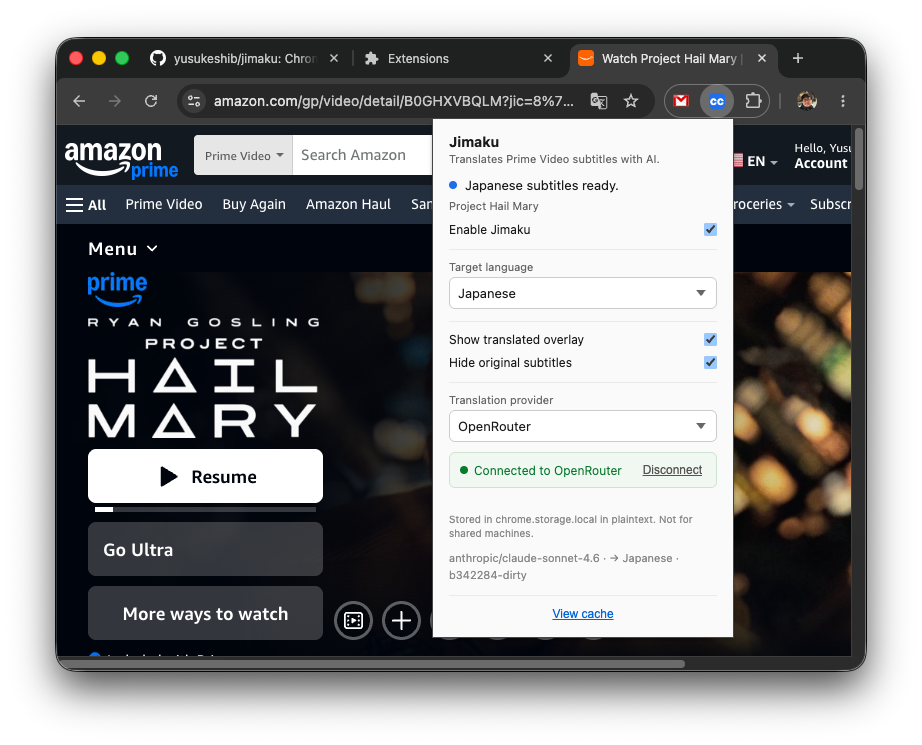
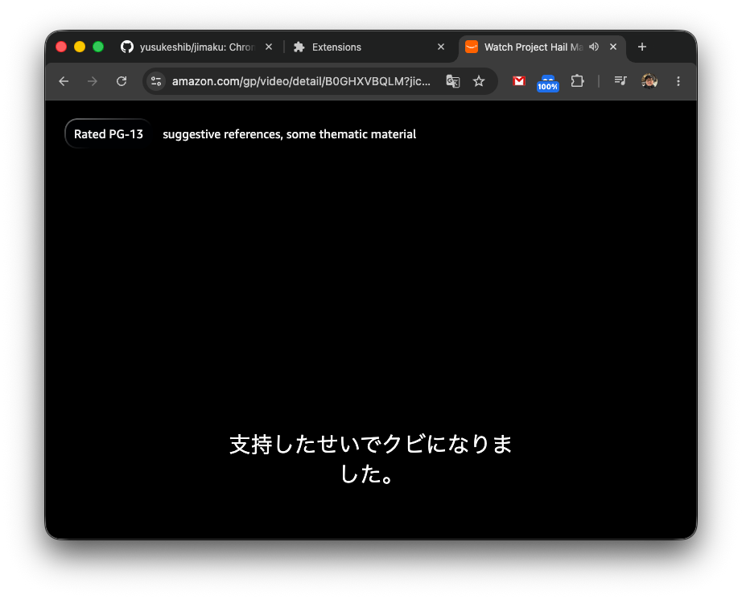
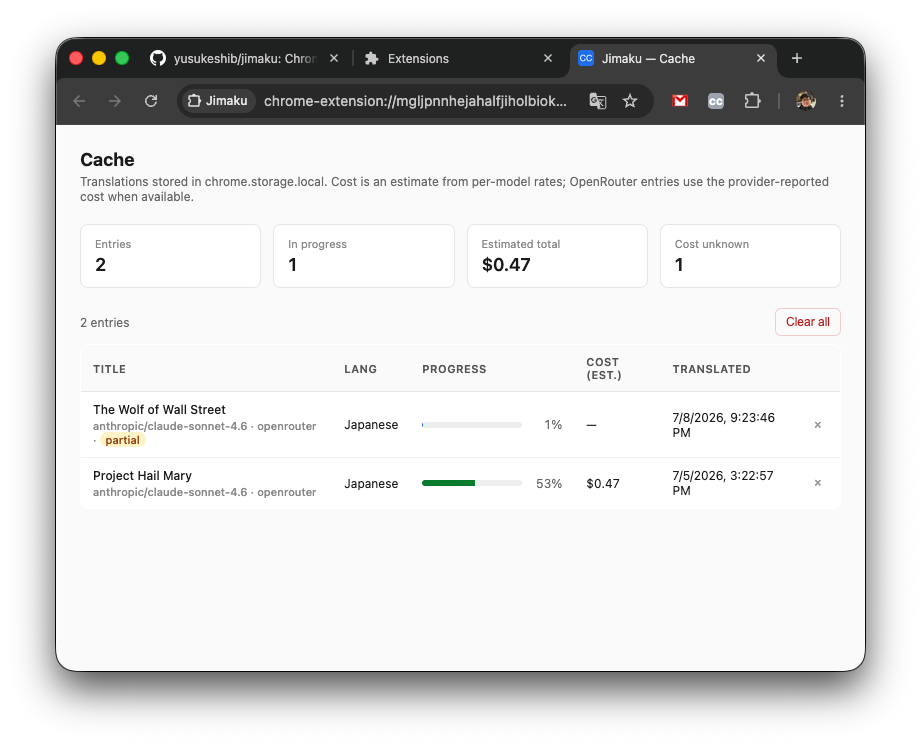

# Jimaku

Chrome extension that translates Prime Video subtitles into your chosen language in real time using AI, and overlays them on the player.

## Usage

1. Open a Prime Video title and start playback with English captions enabled.
2. Click the extension icon — pick a translation provider (OpenRouter, Anthropic, or OpenAI) and target language.
3. Translated lines stream in as the model returns them. Toggle the overlay and original subtitles in the popup to taste.

## Screenshots

| Popup | Overlay | Cache |
| :---: | :---: | :---: |
|  |  |  |
